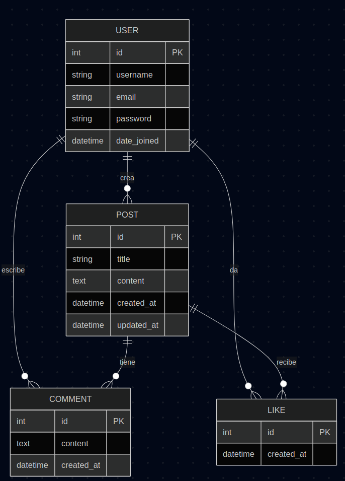
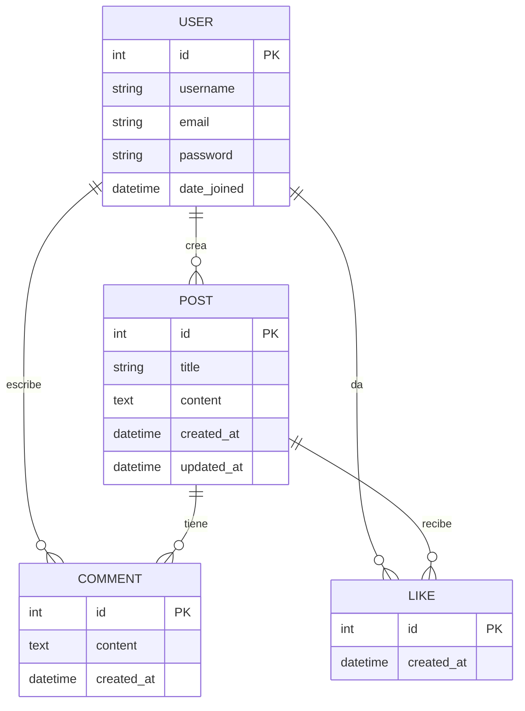

# BlogPost — Backend

Backend del proyecto **BlogPost**, construido con **Django Rest Framework (DRF)**.  
Se encarga de gestionar usuarios, posts, comentarios y likes. Se distribuye como aplicación **dockerizada** para facilitar la ejecución en cualquier entorno.

## 📖 Descripción

Este backend provee una **API REST** para el proyecto BlogPost.  
Incluye autenticación de usuarios, gestión de publicaciones, comentarios y sistema de likes.  
La API está pensada para ser consumida desde el frontend en **Next.js 15**.

## ⚙️ Stack Tecnológico

- **uv**
- **Python 3.12+**
- **Django 5.x**
- **Django Rest Framework (DRF)**
- **PostgreSQL** como base de datos
- **JWT (djangorestframework-simplejwt)** para autenticación
- **pytest** para testing

El backend estará disponible en:  
👉 [http://localhost:8000/api/](http://localhost:8000/api/)

## 🧩 Entidades y Relaciones

El modelo de datos se basa en 4 entidades principales:

### User
- Representa al usuario registrado en la aplicación.
- **Atributos principales**:  
  - `id`  
  - `username`  
  - `email`  
  - `password`  
  - `date_joined`

---

### Post
- Publicaciones creadas por los usuarios.
- **Atributos principales**:  
  - `id`  
  - `title`  
  - `content`  
  - `created_at`  
  - `updated_at`
- **Relación**: cada Post pertenece a **un User** (autor).

---

### Comment
- Comentarios realizados sobre los posts.
- **Atributos principales**:  
  - `id`  
  - `content`  
  - `created_at`
- **Relaciones**:  
  - Cada Comment pertenece a **un User** (autor).  
  - Cada Comment pertenece a **un Post**.

---

### Like
- Representa un "me gusta" de un usuario a un post.
- **Atributos principales**:  
  - `id`  
  - `created_at`
- **Relaciones**:  
  - Cada Like pertenece a **un User**.  
  - Cada Like pertenece a **un Post**.  
- **Restricción**: un usuario no puede dar más de un like al mismo post.

---

## 🔗 Relaciones en resumen

- **User ↔ Post** → Uno a muchos (un usuario puede tener varios posts).  
- **User ↔ Comment** → Uno a muchos (un usuario puede comentar en varios posts).  
- **User ↔ Like** → Uno a muchos (un usuario puede dar likes en distintos posts).  
- **Post ↔ Comment** → Uno a muchos (un post puede tener múltiples comentarios).  
- **Post ↔ Like** → Uno a muchos (un post puede tener múltiples likes).  

---

## 📚 Endpoints (resumen esperado)

- `/api/auth/` → registro, login y gestión de tokens JWT.  
- `/api/users/` → gestión de usuarios.  
- `/api/posts/` → CRUD de posts.  
- `/api/comments/` → CRUD de comentarios.  
- `/api/likes/` → creación y eliminación de likes.  

## 🧩 Diagrama de Entidades y Relaciones

